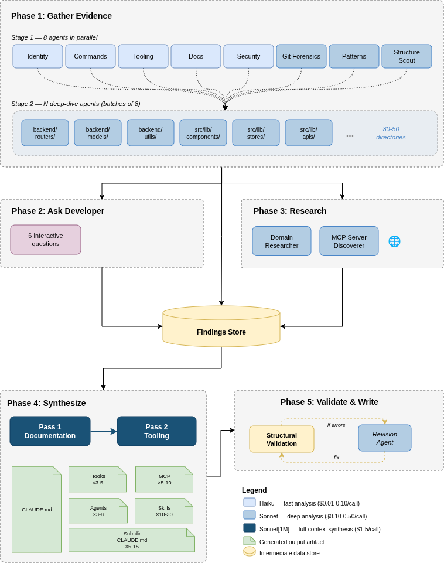

<p align="center">
  
</p>

<h3 align="center">One command. Any codebase. A complete Claude Code configuration.</h3>

${\color{red}\texttt{u}}{\color{orange}\texttt{l}}{\color{Goldenrod}\texttt{t}}{\color{green}\texttt{r}}{\color{violet}\texttt{a}}{\color{blue}\texttt{i}}{\color{pink}\texttt{n}}{\color{red}\texttt{i}}{\color{orange}\texttt{t}}$ deeply analyzes your codebase and generates everything Claude Code needs to work like a senior engineer who's been on the team for months: a comprehensive CLAUDE.md, dozens of skills, hooks, subagents, and MCP server configurations.

```bash
curl -sL https://github.com/joelbarmettlerUZH/ultrainit.sh/releases/latest/download/ultrainit.sh | bash
```

No Python. No npm. No dependencies beyond `claude`, `jq`, and standard Unix tools. Runs 15-30 minutes depending on codebase size. Resumable if interrupted.

---

## The Problem

Setting up Claude Code for a real codebase is hard. A good configuration requires:

- A CLAUDE.md that captures your architecture, patterns, conventions, and gotchas
- Skills for every major workflow (adding endpoints, creating migrations, debugging, etc.)
- Hooks that auto-format code and protect sensitive files
- Subagents for code review, security analysis, and impact assessment
- MCP server connections to your databases, docs, and tools

Writing all of this by hand takes days. Most teams either skip it entirely or write a thin CLAUDE.md that doesn't capture the real complexity of their codebase.

## The Solution

${\color{red}\texttt{u}}{\color{orange}\texttt{l}}{\color{Goldenrod}\texttt{t}}{\color{green}\texttt{r}}{\color{violet}\texttt{a}}{\color{blue}\texttt{i}}{\color{pink}\texttt{n}}{\color{red}\texttt{i}}{\color{orange}\texttt{t}}$ sends a swarm of Claude Code agents to analyze your codebase from every angle (architecture, git history, patterns, tooling, documentation, security) and synthesizes everything into a production-grade configuration.

A typical run on a full-stack web application:

| What | Count |
|------|-------|
| Directories deep-analyzed | 30-60 |
| Root CLAUDE.md | 250-400 lines |
| Subdirectory CLAUDE.md files | 5-15 |
| Skills | 15-30 |
| Hooks | 3-5 |
| Subagents | 3-8 |
| MCP servers configured | 3-8 |

---

## Quick Start

### Prerequisites

- [Claude Code CLI](https://docs.anthropic.com/en/docs/claude-code) installed and authenticated (`claude auth login`)
- `jq` (`brew install jq` / `apt install jq` / `choco install jq`)
- `git`, `bc`, `mktemp`, `sed`, `awk`, `grep` (pre-installed on most systems; the script checks at startup and tells you what's missing)
- [Extra usage](https://claude.ai/settings/usage) enabled (required for 1M context synthesis)
- **Recommended:** [Claude Max subscription](https://claude.ai/settings/billing). All usage is included, making ultrainit free. Without it, expect $30-60 in API credits per run.

### Run

```bash
# Analyze the current directory
curl -sL https://github.com/joelbarmettlerUZH/ultrainit.sh/releases/latest/download/ultrainit.sh | bash

# Analyze a specific project
bash <(curl -sL https://github.com/joelbarmettlerUZH/ultrainit.sh/releases/latest/download/ultrainit.sh) /path/to/project

# Non-interactive (skip developer questions, for CI)
bash <(curl -sL https://github.com/joelbarmettlerUZH/ultrainit.sh/releases/latest/download/ultrainit.sh) --non-interactive

# Clean re-generation: remove existing config first
bash <(curl -sL https://github.com/joelbarmettlerUZH/ultrainit.sh/releases/latest/download/ultrainit.sh) --overwrite

# Use Opus 1M for highest-quality synthesis
bash <(curl -sL https://github.com/joelbarmettlerUZH/ultrainit.sh/releases/latest/download/ultrainit.sh) --model 'opus[1m]'
```

### CLI Options

| Flag | Description |
|------|-------------|
| `--non-interactive` | Skip developer questions (for CI/headless environments) |
| `--force` | Rerun all agents, ignoring cached findings from previous runs |
| `--overwrite` | Back up and remove all existing CLAUDE.md files, skills, hooks, and agents before analysis, then regenerate from scratch. Implies `--force`. **Use this when re-running ${\color{red}\texttt{u}}{\color{orange}\texttt{l}}{\color{Goldenrod}\texttt{t}}{\color{green}\texttt{r}}{\color{violet}\texttt{a}}{\color{blue}\texttt{i}}{\color{pink}\texttt{n}}{\color{red}\texttt{i}}{\color{orange}\texttt{t}}$ on a project that already has configuration.** |
| `--model MODEL` | Model for synthesis passes (default: `sonnet[1m]`). Use `opus[1m]` for maximum quality. |
| `--budget DOLLARS` | Total budget for the entire run (default: 100.00). Automatically divided across phases: 50% gather, 10% research, 30% synthesis, 10% validation. The run stops when the budget is exhausted. |
| `--skip-research` | Skip Phase 3 entirely (domain research and MCP discovery) |
| `--skip-mcp` | Skip MCP server discovery only (still runs domain research) |
| `--dry-run` | Run all analysis and synthesis but don't write any files to the project |
| `--verbose` | Print agent stderr to the terminal for debugging |
| `-h`, `--help` | Show usage information |

| Environment Variable | Description |
|---------------------|-------------|
| `ULTRAINIT_MODEL` | Default model for gather/research agents (default: `sonnet`) |
| `ULTRAINIT_BUDGET` | Total run budget in USD (default: `100.00`) |

### What Gets Generated

```
your-project/
├── CLAUDE.md                           # Root configuration (250-400 lines)
├── backend/CLAUDE.md                   # Backend-specific conventions
├── frontend/CLAUDE.md                  # Frontend-specific conventions
├── ...more subdirectory CLAUDE.md...
└── .claude/
    ├── skills/
    │   ├── add-api-endpoint/SKILL.md   # Scaffolding: new endpoints
    │   ├── add-migration/SKILL.md      # Scaffolding: DB migrations
    │   ├── add-component/SKILL.md      # Scaffolding: UI components
    │   ├── debug-backend/SKILL.md      # Debugging: backend issues
    │   ├── debug-frontend/SKILL.md     # Debugging: frontend issues
    │   ├── pre-pr-checklist/SKILL.md   # Workflow: PR preparation
    │   └── ...10-20 more skills...
    ├── agents/
    │   ├── code-reviewer.md            # Read-only code review
    │   ├── security-reviewer.md        # Security-focused review
    │   └── ...more subagents...
    ├── hooks/
    │   ├── format-backend.sh           # Auto-format on save
    │   ├── format-frontend.sh          # Auto-format on save
    │   └── guard-migrations.sh         # Block edits to migrations
    ├── mcp.json                        # MCP server configurations
    └── settings.json                   # Hook wiring
```

---

## How It Works

${\color{red}\texttt{u}}{\color{orange}\texttt{l}}{\color{Goldenrod}\texttt{t}}{\color{green}\texttt{r}}{\color{violet}\texttt{a}}{\color{blue}\texttt{i}}{\color{pink}\texttt{n}}{\color{red}\texttt{i}}{\color{orange}\texttt{t}}$ runs in five phases. Each phase sends one or more Claude Code agents (`claude -p`) with focused prompts, scoped tool access, and structured JSON output schemas.

### Phase 1: Gather Evidence

**8 specialist agents** run in parallel, each examining the codebase from a different angle:

| Agent | Model | What It Does |
|-------|-------|-------------|
| **Identity** | Haiku | Detects project name, languages, frameworks and versions, monorepo structure, deployment target |
| **Commands** | Haiku | Finds every build, test, lint, format, and typecheck command from package.json, Makefiles, CI pipelines |
| **Git Forensics** | Sonnet | Analyzes commit history for hotspots, bug-fix density, temporal coupling, ownership patterns, commit conventions |
| **Patterns** | Sonnet | Discovers architectural patterns, error handling, import conventions, naming conventions, state management, auth patterns |
| **Tooling** | Haiku | Identifies configured linters, formatters, type checkers, and pre-commit hooks so CLAUDE.md doesn't duplicate their rules |
| **Docs Scanner** | Haiku | Finds and summarizes all existing documentation, identifies documented vs undocumented conventions |
| **Security Scanner** | Haiku | Identifies files that need protection: secrets, migrations, lock files, generated code, security-critical modules |
| **Structure Scout** | Sonnet | Maps the directory tree 3+ levels deep, classifies every directory by role and priority, identifies which directories need their own CLAUDE.md |

Then, based on the Structure Scout's map, **deep-dive agents** spawn: one per important directory, running in parallel batches of 8. A typical full-stack project has 30-50 directories analyzed this way. Each deep-dive agent reads actual source files (not just filenames) and reports:

- Internal architecture and organization philosophy
- Key files with importance rankings
- Coding patterns with example files
- Naming, import, and error handling conventions
- Dependencies (internal and external)
- Gotchas that would trip up unfamiliar developers
- **Skill opportunities**: multi-step workflows that should become skills

This phase produces 500KB-1MB of structured findings.

### Phase 2: Ask the Developer

Five interactive questions capture knowledge that code analysis can't provide:

1. What is the primary purpose of this project?
2. How is it deployed?
3. What should Claude NEVER do in this codebase?
4. What trips up new developers on this project?
5. Anything else important?

Skipped with `--non-interactive`.

### Phase 3: Research

Two agents search the web in parallel:

| Agent | What It Does |
|-------|-------------|
| **Domain Researcher** | Researches framework-version-specific best practices, domain terminology, and common pitfalls for the detected tech stack |
| **MCP Discoverer** | Searches the [MCP registry](https://registry.modelcontextprotocol.io), [GitHub MCP org](https://github.com/mcp), and web for MCP servers matching the project's databases, frameworks, and services |

The MCP discoverer always considers `context7` (up-to-date library docs) and `playwright` (browser automation) as near-universal recommendations, plus database-specific servers matching the project's actual data stores.

Skipped with `--skip-research`.

### Phase 4: Synthesize

All findings (~1MB) are fed into two focused synthesis passes using the **1M context** model:

**Pass 1 (Documentation):** Generates the root CLAUDE.md and all subdirectory CLAUDE.md files. The model receives the full findings and a prompt focused entirely on producing comprehensive, well-structured documentation with deep architecture coverage, real file references, and concrete conventions.

**Pass 2 (Tooling):** Generates skills, hooks, subagents, MCP server configurations, and settings. The model receives the generated CLAUDE.md from Pass 1 as source of truth, plus focused findings relevant to tooling: skill opportunities, patterns, security rules, and MCP recommendations.

Splitting into two passes lets each focus deeply rather than trying to produce everything at once.

### Phase 5: Validate and Write

Generated artifacts go through structural validation:

**CLAUDE.md checks:**
- Minimum length (thin output is flagged)
- Zero generic phrases ("best practice", "clean code", etc.)
- Must contain command tables or code blocks
- Prohibitions must include alternatives

**Skill checks** (via `scripts/validate-skill.sh`):
- Frontmatter: kebab-case name, description with trigger phrases and negative scope, no angle brackets
- Body: minimum 3 codebase-specific file references, verification section
- No generic programming phrases

**Hook checks:**
- Shebang + `set -euo pipefail`
- Reads JSON from stdin
- Blocking hooks print actionable error messages
- Every hook has matching settings.json wiring

**Subagent checks** (via `scripts/validate-subagent.sh`):
- Frontmatter: name, description with trigger phrases
- Tool scoping matches described purpose (reviewers shouldn't have Write)
- Minimum 3 codebase-specific references

If validation fails, a **revision agent** automatically fixes the issues and re-validates.

Finally, artifacts are written to disk with safe merge behavior:
- `CLAUDE.md`: Overwritten (previous version backed up)
- Skills, hooks, subagents: merge-only; new files added, existing files never overwritten
- `settings.json`: deep-merged; new hooks added, existing preserved
- `mcp.json`: deep-merged; new servers added, existing preserved

---

## Cost

${\color{red}\texttt{u}}{\color{orange}\texttt{l}}{\color{Goldenrod}\texttt{t}}{\color{green}\texttt{r}}{\color{violet}\texttt{a}}{\color{blue}\texttt{i}}{\color{pink}\texttt{n}}{\color{red}\texttt{i}}{\color{orange}\texttt{t}}$ uses real Claude API calls. Costs depend on codebase size and complexity.

| Phase | Agents | Typical Cost |
|-------|--------|-------------|
| Phase 1: Gather (core) | 8 parallel | $2-5 |
| Phase 1: Gather (deep-dives) | 30-60 parallel | $20-40 |
| Phase 3: Research | 2 parallel | $1-3 |
| Phase 4: Synthesize | 2 sequential | $4-10 |
| Phase 5: Validate/Revise | 0-1 | $0-1 |
| **Total** | | **$30-60** |

With `--model 'opus[1m]'` for synthesis: $50-100 total. A real run on [open-webui](https://github.com/open-webui/open-webui) (full-stack SvelteKit + FastAPI, 58 directories) cost **$45**.

The `--budget` flag sets a total spending cap (default: $100). The budget is automatically divided across phases (50% gather, 10% research, 30% synthesis, 10% validation) and then split equally among agents within each phase. If the budget is exhausted mid-run, remaining agents are skipped. Actual costs are tracked precisely and displayed at the end of each run.

If the budget seems too low for the selected model, a warning is shown at startup.

**Recommended: [Claude Max subscription](https://claude.ai/settings/billing).** With Claude Max, all API usage from Claude Code is included in your subscription, making ultrainit effectively free. Without a subscription, a typical run costs $30-60 in API credits.

---

## Resumability

${\color{red}\texttt{u}}{\color{orange}\texttt{l}}{\color{Goldenrod}\texttt{t}}{\color{green}\texttt{r}}{\color{violet}\texttt{a}}{\color{blue}\texttt{i}}{\color{pink}\texttt{n}}{\color{red}\texttt{i}}{\color{orange}\texttt{t}}$ saves all intermediate results to `.ultrainit/` in your project directory. If the script crashes, is interrupted, or a phase fails:

- Rerun the same command; completed agents and phases are skipped automatically
- Failed agents are retried on the next run; successful ones are not re-run
- If critical agents fail (identity, structure-scout) or too many agents fail (3+), the script stops with a Claude-powered diagnosis explaining what went wrong and how to fix it
- Use `--force` to rerun everything from scratch
- The `.ultrainit/` directory is automatically added to `.gitignore`

```
.ultrainit/
├── findings/           # Raw JSON from each agent (cached)
│   ├── identity.json
│   ├── patterns.json
│   ├── module-backend.json
│   └── ...
├── synthesis/          # Synthesis pass outputs
├── logs/               # stderr from each agent
├── backups/            # Previous CLAUDE.md versions
├── cost.log            # Per-agent cost tracking
└── state.json          # Phase completion tracking
```

---

## Architecture Diagram



---

## FAQ

### How is this different from just asking Claude to "read my codebase and create a CLAUDE.md"?

${\color{red}\texttt{u}}{\color{orange}\texttt{l}}{\color{Goldenrod}\texttt{t}}{\color{green}\texttt{r}}{\color{violet}\texttt{a}}{\color{blue}\texttt{i}}{\color{pink}\texttt{n}}{\color{red}\texttt{i}}{\color{orange}\texttt{t}}$ sends 30-60 focused agents with structured output schemas, scoped tool access, and specific system prompts. Each agent is an expert at one thing: git forensics, security scanning, pattern detection, etc. A single Claude session can't match this depth because:

1. **Parallel analysis**: 8 agents examine the codebase simultaneously from different angles
2. **Structured output**: JSON schemas enforce completeness; agents can't skip fields
3. **Hierarchical exploration**: The structure scout maps 3+ levels deep, then dedicated agents deep-dive into each important directory
4. **Web research**: Domain practices and MCP servers are discovered via live web search
5. **Validation**: Generated artifacts are structurally validated and automatically revised if issues are found

### Does it work with monorepos?

Yes. The identity agent detects monorepo structures (workspaces, Lerna, Turborepo, Nx) and the structure scout maps all packages. Each package gets its own deep-dive analysis and potentially its own subdirectory CLAUDE.md.

### How does it handle existing Claude Code configuration?

${\color{red}\texttt{u}}{\color{orange}\texttt{l}}{\color{Goldenrod}\texttt{t}}{\color{green}\texttt{r}}{\color{violet}\texttt{a}}{\color{blue}\texttt{i}}{\color{pink}\texttt{n}}{\color{red}\texttt{i}}{\color{orange}\texttt{t}}$ uses `claude -p` to spawn analysis agents. These agents run in your project directory, which means they **will see and be influenced by existing CLAUDE.md files and `.claude/` config**. This has two implications:

**First run (no existing config):** Agents analyze the raw codebase and generate everything from scratch. This is the ideal case.

**Re-running (existing config present):** Agents may read existing CLAUDE.md files and parrot back existing rules rather than rediscovering from source. For a clean re-generation, use `--overwrite`:

```bash
ultrainit.sh --overwrite
```

This backs up all existing configuration to `.ultrainit/backups/`, removes it, then runs the full analysis on the bare codebase.

**Without `--overwrite`**, the default merge behavior is conservative:
- Root `CLAUDE.md`: overwritten (backed up)
- Skills, hooks, agents: merge-only; new files added, existing files never touched
- `settings.json` and `mcp.json`: deep-merged; new entries added, existing preserved

### Can I customize the output?

The generated artifacts are standard Claude Code configuration files. Edit anything after generation; it's your configuration. The developer interview (Phase 2) is the main way to influence output before generation. For subsequent runs, `--overwrite` gives you a clean slate; without it, your manual edits to skills/hooks/agents are preserved.

### What models are used?

| Task | Default Model |
|------|------|
| Fast analysis (identity, commands, tooling, docs, security) | Haiku |
| Deep analysis (patterns, git, structure, deep-dives, research) | Sonnet |
| Synthesis (CLAUDE.md, skills, hooks, agents) | Sonnet[1M] |

Use `--model 'opus[1m]'` for maximum quality synthesis.

### How long does it take?

Typically **15-30 minutes** depending on codebase size:
- Phase 1: 5-15 minutes (8 core agents + 30-60 deep-dive agents, parallelized in batches)
- Phase 2: 1-2 minutes (interactive)
- Phase 3: 1-2 minutes (parallelized)
- Phase 4: 3-8 minutes (two synthesis passes)
- Phase 5: 1-3 minutes (validation + write)

Large monorepos with 50+ directories can take up to 30 minutes. The run is fully resumable: if interrupted, rerun the same command and completed phases are skipped.

### What about rate limits?

Deep-dive agents run in batches of 8 to avoid API rate limits. Individual agent failures are tolerated: if 1-2 non-critical agents fail, the pipeline continues with partial results. However, if critical agents fail (identity, structure-scout) or 3+ agents fail in the same phase, the script stops with a diagnosis explaining the root cause and how to fix it. On re-run, only the failed agents are retried.

---

## Prerequisites

### Required

- [Claude Code CLI](https://docs.anthropic.com/en/docs/claude-code) installed and authenticated (`claude auth login`)
- `jq`. Install via `brew install jq` (macOS), `apt install jq` (Linux), or `choco install jq` (Windows/Git Bash)
- `git`, `bc`, `mktemp`, `sed`, `awk`, `grep` (pre-installed on most systems)
- **Extra usage enabled.** The synthesis phase uses models with 1M token context. Enable extra usage at [claude.ai/settings/usage](https://claude.ai/settings/usage), otherwise synthesis will fail with "Extra usage is required for 1M context".

The script checks all dependencies at startup and tells you exactly what's missing and how to install it.

### Platform Support

| Platform | How to Run |
|----------|-----------|
| **Linux** | Works directly. All dependencies are usually pre-installed except `jq`. |
| **macOS** | Works directly. Install `jq` via `brew install jq`. May need `bc` via `brew install bc`. |
| **Windows** | Use **Git Bash** (included with [Git for Windows](https://git-scm.com/download/win)) or **WSL**. Native `cmd.exe` / PowerShell are **not supported**. Install `jq` and `bc` with `choco install jq bc`. |

**Windows users:** The script detects if you're running outside of a bash shell and will warn you with instructions to use Git Bash. If you see errors about missing commands, make sure you're running inside Git Bash or WSL, not PowerShell or CMD.

---

## Author

Built by [Joel Barmettler](https://joelbarmettler.xyz).

## License

Apache License 2.0. See [LICENSE](LICENSE).
